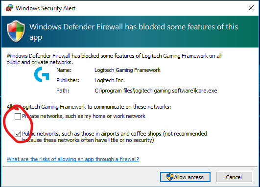
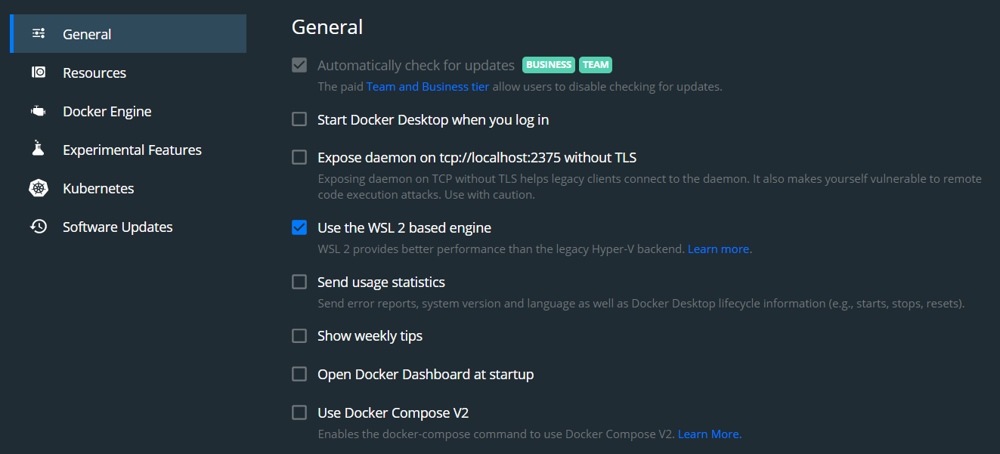
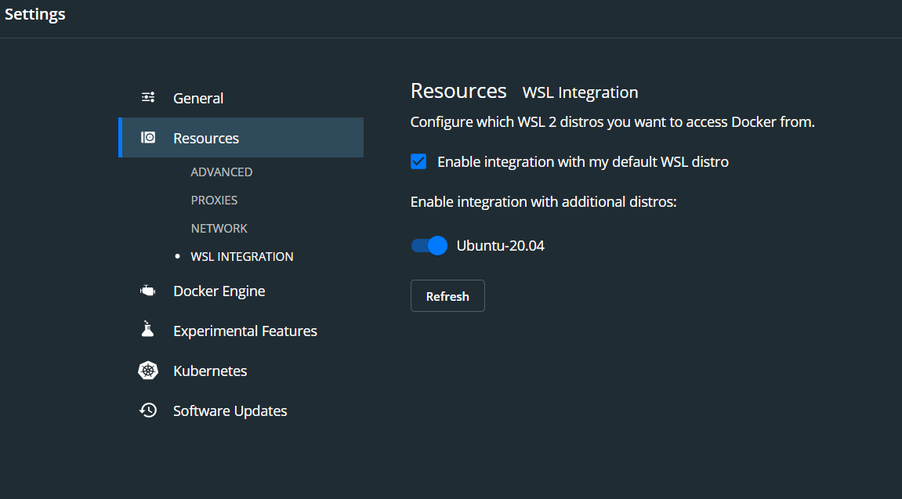
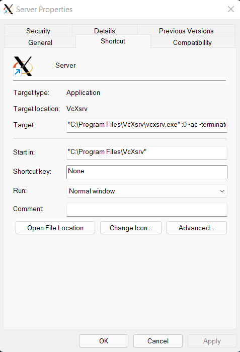
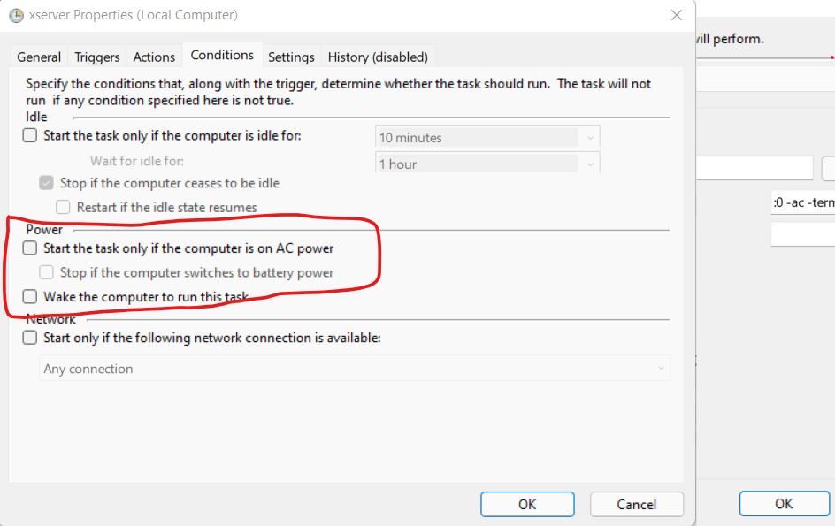

# WSL2 Guide on windows 10

WSL2 will enable you to use the linux sub system on windows 10. This should also work on windows 11.

# Notes before starting

If you ever get firewall notifications for either docker, ubuntu, any other applications that you install, its important to tick box of these boxes and allow access



Its important you learn the following as we will be referring  to these terms often.
 
- WSL2 stands for Windows Subsystem for linux. Always use version 2. It lets you use linux operating systems such as ubuntu as close to native as possible. https://en.wikipedia.org/wiki/Windows_Subsystem_for_Linux
- Display Servers enable you to run GUI apps from a linux shell. https://en.wikipedia.org/wiki/Windowing_system#Display_server
- Windows 11 Wayland is one implementation of a Display Server . It comes packaged with Windows 11. Windows 10 does not, therefore the `DISPLAY` export isn't needed but you can override this if you wish to use your own X Server if you are on Windows 11.
- Its recommended you run intellij from within wsl2 to get a more native linux experience. It also indexes faster. 
- Use ~/.bashrc if your using bash or ~/.zshrc for zsh users.

# Pre-requisites 
- WSL 2 is only available in Windows 10, Version 1903, Build 18362 or higher.

## Install WSL2
In a powershell admin run the following. First command will install chocolatey, a package manager. 
```
Set-ExecutionPolicy Bypass -Scope Process -Force; [System.Net.ServicePointManager]::SecurityProtocol = [System.Net.ServicePointManager]::SecurityProtocol -bor 3072; iex ((New-Object System.Net.WebClient).DownloadString('https://chocolatey.org/install.ps1'))
```

Install WSL and the recommended Ubuntu distro. Once ubuntu-2004 is installed run it from your start menu and follow the instructions.

```
wsl --install
choco install wsl-ubuntu-2004
```

Microsoft terminal is very useful and nice to use
```
choco install microsoft-windows-terminal
```
Once ubuntu-2004 is installed run it from your start menu and follow the instructions.
You can now use the windows terminal from the start menu. All below commands unless explicitly mentioned should use the windows terminal running the ubuntu20.04 distro. 

## Install sdk man a java package manager
```
curl -s "https://get.sdkman.io" | bash
source "$HOME/.sdkman/bin/sdkman-init.sh"
sdk list java
sdk install java 11.0.11.hs-adpt
java --version
```

## Install homebrew as it's useful for installing things like maven. Homebrew is not just for mac!
```
/bin/bash -c "$(curl -fsSL https://raw.githubusercontent.com/Homebrew/install/HEAD/install.sh)"

brew install maven
mvn --version
```

## Install docker 
Note this will be updated later to use the free version of docker due to license restrictions. For now, you can use docker for windows
https://docs.docker.com/desktop/windows/install/

Tick all boxes for any firewall windows for this application





Restart your windows terminal and test docker via the following commands
```
docker run hello-world
docker ps
```

## WSLG Apps
We can use a display server to run gui apps. For testing purposes we will be using gedit and Nautilus(file explorer)

Install your display server from https://sourceforge.net/projects/vcxsrv/

Create a windows shortcut to point to your display server. You can use the one inside the scripts folder as its set up with the below arguments. By running this, it should run your display server in background. Tick all boxes for any firewall windows for this application



```
"C:\Program Files\VcXsrv\vcxsrv.exe" :0 -ac -terminate -lesspointer -multiwindow -clipboard -wgl -swcursor -dpi 144
```

Install gui apps and run them. You can use Ctrl+Z/Ctrl+C to exit them within terminal if they do not shut down properly. The DISPLAY export lets you 

Store the below in your .bashrc or .zshrc file. This will point to the display server(VcXsrv)
```
export DISPLAY="`grep nameserver /etc/resolv.conf | sed 's/nameserver //'`:0"
```

```
sudo apt install nautilus
sudo apt install gedit
nautilus
gedit
```

You can also install intellij with the following commands.
```
cd
mkdir scripts
```

For community intellij users
```
wget https://download.jetbrains.com/idea/ideaIC-2021.2.3.tar.gz

tar -zxf ideaIU-2021.2.2.tar.gz
```

For intellij ultimate users
```
wget https://download.jetbrains.com/idea/ideaIU-2021.2.3.tar.gz
tar -zxf ideaIU-2021.2.3.tar.gz
```

I usually create an alias to run this via one of the below commands. Use the correct path. I usually store this in either the `.bashrc`  or `.zshrc`
```
alias idea='/home/mohim/scripts/idea-IU-212.5284.40/bin/idea.sh $1 > /dev/null 2>&1 &'

idea
```

## Integration with VS Code
VS Code probably has the best integration with wsl2. 
- Install VS Code - https://code.visualstudio.com/
- Install the plugin for WSL2


Then if you restart your pc/terminal you can run `code dir` within the windows terminal and it will open up your folders/files in vs code code.

## Running the Display server as a task when you log in
If you don't want to run the display server every time you start your pc you can setup a basic task

Open up task scheduler from the start menu. Add a basic task with these instructions and arguments. This will run every time you log in. Its import to untick the boxes in red even they are greyed out.





# Troubleshooting
- If you have issues running wsl2 on bootup then you can disable fastboot. https://stephenreescarter.net/wsl2-network-issues-and-win-10-fast-start-up/


# TODO

- Update troubleshooting guide with scaling bugs
- Add more wsl2 tips from existing files
- Upload to github
- vs code editor
- map folder
- paste stuff to intellij and nautilus
- Map wsl2 as a network drive for easy exploring within file explorer
- get rid of scaling errors with nautilus
- scale pictures on readme a little smaller
- zsh history messing up

